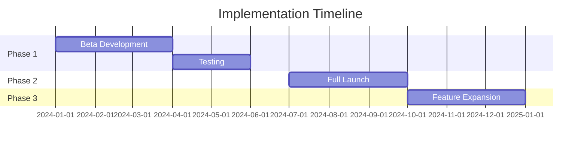

# OKX Social Recovery Hub
## Product Recommendation Document
*Proposed by: Product Management Team*

### 1. Executive Summary
The OKX Social Recovery Hub is a revolutionary feature designed to address one of the most critical challenges in Web3 adoption: wallet recovery and security. By implementing a social recovery system enhanced with AI-powered verification, we aim to make wallet recovery more secure and user-friendly while maintaining decentralization principles.

### 2. Product Background

#### Market Analysis
- 75% of crypto users fear losing access to their wallets
- 20% of Bitcoin is estimated to be lost due to forgotten passwords or lost private keys
- Social recovery solutions are gaining traction (e.g., Argent, Soul Wallet)
- Current solutions lack sophisticated verification methods

#### User Pain Points
- Complex recovery processes
- High risk of permanent loss
- Limited options for secure backup
- Trust issues with guardians
- Recovery attempts fraud

### 3. Product Solution

#### Core Feature: Social Recovery Hub
A comprehensive recovery system that combines social guardians with AI-powered verification:

1. **Guardian Management System**
   - Nominate 3-5 trusted guardians
   - Mix of personal contacts and institutional guardians
   - Guardian scoring system based on reliability
   - Regular guardian activity verification

2. **AI-Powered Verification Layer**
   - Biometric authentication
   - Behavioral pattern analysis
   - Transaction history verification
   - Voice recognition for recovery requests

3. **Recovery Process Flow**
   ```mermaid
   graph TD
   A[User Initiates Recovery] --> B[AI Verification]
   B --> C[Guardian Notifications]
   C --> D[Guardian Verification]
   D --> E[Recovery Threshold Check]
   E --> F[Wallet Access Restored]
   ```

4. **Security Features**
   - Time-locked recovery periods
   - Multi-factor authentication
   - Fraud detection system
   - Emergency lockdown option

### 4. Implementation Strategy

#### MVP Features
- Basic guardian management
- Simple recovery flow
- Essential security checks
- Mobile app integration

#### Success Metrics
- Recovery success rate
- Guardian response time
- User satisfaction score
- Security incident rate
- Recovery attempt completion rate

#### Go-to-Market Strategy
1. **Phase 1: Beta Launch**
   - Limited user testing
   - Guardian onboarding
   - Feature refinement

2. **Phase 2: Full Launch**
   - Marketing campaign
   - Educational content
   - Partnership program

3. **Phase 3: Expansion**
   - Institutional guardian network
   - Advanced AI features
   - Cross-chain support

### 5. Competitive Advantage
- First comprehensive AI-powered social recovery system
- Institutional guardian network
- Behavioral analysis security layer
- User-friendly interface
- Cross-platform compatibility

### 6. Timeline & Resources


### 7. Risk Assessment
- Guardian reliability
- AI system accuracy
- User adoption rate
- Regulatory compliance
- Technical integration

### 8. Expected Impact
- 50% reduction in permanent wallet loss
- 30% increase in new user onboarding
- 40% improvement in recovery success rate
- 25% increase in user confidence

This proposal aims to position OKX as the leader in secure and user-friendly Web3 wallet solutions while addressing critical user needs and market gaps.
